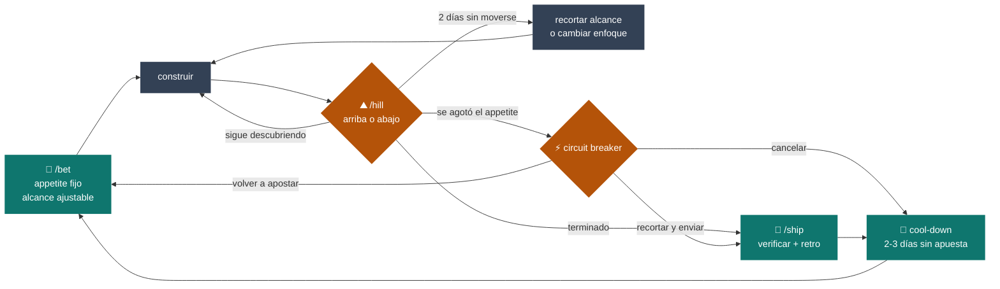
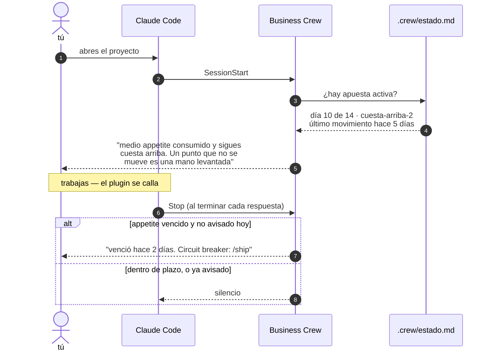
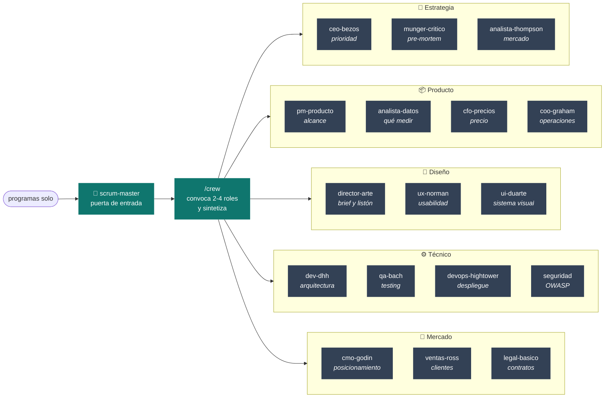

# Business Crew

> **In English:** a Claude Code plugin that gives solo builders a startup team of 18
> specialised agents (product, pricing, sales, security, QA, UX, architecture and more) plus
> a work cycle based on [Shape Up](https://basecamp.com/shapeup): fixed appetite, hill chart
> and circuit breaker. None of the agents writes code; each one gives an opinion from its
> role and the next step. Works for any product type (SaaS, ecommerce, landing, internal
> tool). **The agents, commands and documentation are written in Spanish.**
>
> ```bash
> claude plugin marketplace add fernando-delrio/business-crew
> claude plugin install business-crew@business-crew
> ```

**Programar solo no tiene por qué sentirse solo.**

Un plugin de Claude Code que te presta un equipo entero: 18 agentes con persona real
—Scrum Master, CEO, producto, UX, UI, dirección de arte, datos, arquitectura, QA, DevOps,
seguridad, marketing, ventas, mercado, finanzas y legal— **más un ciclo de trabajo real**
para que el proyecto avance como en una empresa y no a impulsos.

Ninguno escribe código. Cada uno opina desde su rol y te da el siguiente paso. Tú decides
y ejecutas.

---

## Qué lo hace distinto

**1. Un ciclo de verdad, no ceremonias vacías.** Está construido sobre
[Shape Up](https://basecamp.com/shapeup) (Basecamp), no sobre Scrum. Scrum necesita un
equipo de 5-9 personas para tener sentido; un *daily standup* contigo mismo es teatro.
Shape Up resuelve los tres problemas reales de trabajar solo:

| | |
|---|---|
| **Appetite en vez de estimación** | El tiempo es fijo, el alcance se ajusta. Dejas de fallar plazos |
| **Hill chart en vez de porcentajes** | ¿Descubriendo o ejecutando? Detecta que llevas 4 días atascado |
| **Circuit breaker** | Si se agota el tiempo: recortas, cancelas o vuelves a apostar. Nunca "un poco más" |
| **Sin backlog** | Se decide de cero cada ciclo. Se acabó la lista de 40 ideas que da culpa |



**El bucle nunca se sale por "seguir un poco más".** Cuando el appetite se agota solo hay
tres salidas, y las tres son decisiones conscientes.

**2. Te habla solo cuando hace falta.** Al abrir el proyecto te recuerda la apuesta activa
y el día del ciclo. Si el punto de la colina lleva dos días sin moverse, te avisa —
trabajando solo, nadie más lo va a notar. El resto del tiempo se calla.



**Un hook que habla en cada respuesta deja de leerse a la semana.** Por eso el de `Stop`
solo abre la boca si el appetite está vencido, y como mucho una vez al día.

**3. Piensa antes de darte opciones.** Regla dura: **ningún agente responde sí/no a una
pregunta de producto.** Se reformula a 2-3 caminos comparados, incluyendo siempre el de
no construir nada. Una mente compara mejor de lo que evalúa.

**4. Dirección de arte, no más plantillas.** El `director-arte` exige un brief antes de
que se escriba una línea de interfaz, reconoce la huella del diseño generado por IA
(degradado índigo-morado, Inter por defecto, tres tarjetas en fila) y puntúa con la
rúbrica real de Awwwards: **Diseño 40 · Usabilidad 30 · Creatividad 20 · Contenido 10**.
No reimplementa tus skills de diseño: sabe a cuál llamar.

---

## Funciona en cualquier producto

Los agentes no saben nada de tu proyecto de antemano: **saben preguntar.** Cada uno lleva
ajuste por tipo de producto y una sección de *cuándo NO aporta*, así que en una landing te
dirán que ventas no pinta nada, en vez de improvisar un embudo.

`saas-b2b` · `saas-b2c` · `ecommerce` · `landing` · `marketplace` · `herramienta-interna` ·
`contenido` · `portfolio-personal` · `app-movil` · `api-servicio`

---

## Instalación

```bash
claude plugin marketplace add fernando-delrio/business-crew
claude plugin install business-crew@business-crew
```

Después, copia la plantilla de cartera y rellénala:

```bash
curl -o ~/.claude/PORTFOLIO.md \
  https://raw.githubusercontent.com/fernando-delrio/business-crew/main/PORTFOLIO.template.md
```

**Ese último paso no es opcional.** Sin `~/.claude/PORTFOLIO.md` los agentes funcionan,
pero te preguntarán el contexto en cada conversación en vez de saberlo.

---

## Uso

### El ciclo

```bash
/bet   # abre una apuesta: da forma al problema, fija appetite, escribe el no-go
/hill  # ¿cuesta arriba o cuesta abajo? detecta atascos y avisa si el tiempo aprieta
/ship  # cierra el ciclo: verifica, retro corta, archiva y arranca el cool-down
```

### El equipo

```bash
/crew                                # pasa lista: quién aplica a este proyecto
/crew ¿lanzo ya o sigo puliendo?     # convoca a los roles relevantes y sintetiza
@director-arte revisa esta pantalla  # o llama a uno directamente
```

`/crew` elige quién debe estar en la conversación, los lanza en paralelo y devuelve una
síntesis **incluyendo dónde no se ponen de acuerdo**, que suele ser la parte útil.

---

## El equipo

No son 18 agentes sueltos: hay una puerta de entrada que decide **quién debe estar en cada
conversación**. Convocar a los dieciocho no es un equipo, es una reunión inútil.



Cada agente declara además **cuándo NO aporta**: en una landing, `ventas-ross` te dice que
ahí no pinta nada y deriva, en vez de improvisarte un embudo.

| Agente | Rol | Cuándo |
|---|---|---|
| `scrum-master` | Punto de entrada | No sabes por dónde seguir. Protege el ciclo activo |
| `ceo-bezos` | Visión y prioridad | Dónde poner el foco. Decisiones tipo 1 vs tipo 2 |
| `munger-critico` | Pre-mortem | Antes de invertir tiempo serio. Dónde va a fallar |
| `pm-producto` | Alcance | Qué construir y sobre todo qué no |
| `analista-datos` | Métricas | Qué medir, si algo funcionó de verdad |
| `cfo-precios` | Precio y márgenes | Cuánto cobrar, si es rentable |
| `coo-graham` | Operaciones | Automatizar o hacerlo a mano |
| `ux-norman` | Usabilidad | Un flujo confunde. Golfos de ejecución y evaluación |
| `ui-duarte` | Sistema visual | Escala, roles de color, densidad, estados |
| `director-arte` | Dirección de arte | Antes de construir interfaz. Brief y listón |
| `dev-dhh` | Arquitectura | Simplicidad vs sobre-ingeniería |
| `qa-bach` | Testing | Qué asunciones no has verificado |
| `devops-hightower` | Infraestructura | Despliegue, entornos, por qué falla |
| `seguridad` | Seguridad | Antes de exponer algo o manejar datos reales |
| `cmo-godin` | Posicionamiento | Mensaje, marca, audiencia mínima viable |
| `ventas-ross` | Ventas | Primeros clientes, embudo repetible |
| `analista-thompson` | Mercado | Competencia, dónde está el poder real |
| `legal-basico` | Primera lectura legal | Licencias, contratos — no sustituye a un abogado |

## Las skills

| Skill | Qué aporta |
|---|---|
| `shape-up-cycle` | Appetite, hill chart, circuit breaker, cool-down, sin backlog |
| `design-direction` | Brief de 5 decisiones, rúbrica Awwwards, anti-slop, dónde buscar referencia |
| `decision-framing` | Comparar en vez de evaluar, separar problema de solución, reversibilidad |

---

## Estructura

```
business-crew/
├── .claude-plugin/     plugin.json · marketplace.json
├── agents/             18 roles
├── skills/             3 skills
├── commands/           /crew /bet /hill /ship
├── hooks/              SessionStart + Stop
├── rules/              contrato de salida y reglas de orquestación
├── scripts/            carga del ciclo y aviso de cierre
├── evals/              evaluadores y resultados que miden si cada agente se activa bien
├── docs/               diseño y mapa de capacidades (v0.2)
├── PORTFOLIO.template.md
├── CONTRIBUTING.md · SECURITY.md · CHANGELOG.md · LICENSE
└── .github/            plantillas de issues
```

El ciclo vive en `.crew/estado.md` dentro de cada proyecto. Trabajando solo conviene
versionarlo: el historial de apuestas es la memoria del proyecto.

---

## Qué NO hace

- **No escribe código.** Para eso ya tienes Claude Code.
- **No revisa tu código línea a línea.** Eso son agentes de revisión, otra cosa.
- **No sustituye a un abogado, un asesor fiscal ni un auditor de seguridad.**
  `legal-basico` y `seguridad` te dicen explícitamente cuándo toca un profesional.
- **No reimplementa skills de diseño o animación.** Si tienes `animate`, `emil-design-eng`
  o `accessibility`, el `director-arte` deriva a ellas en vez de duplicarlas.

## Mantenimiento

- **Actualiza `~/.claude/PORTFOLIO.md` tú mismo.** Es la única fuente de verdad.
  Uno desactualizado es peor que ninguno: hace que el equipo opine con seguridad sobre
  un estado que ya no existe.
- **Edita los agentes que no te encajen.** Son tuyos.
- **No metas conocimiento de un proyecto concreto dentro de un agente.** Va en el
  `PORTFOLIO.md`. Un agente con un proyecto grabado dentro deja de servir para el siguiente,
  y lo peor es que no falla: responde con confianza sobre el proyecto equivocado.

## Créditos

Construido sobre las ideas de [Shape Up](https://basecamp.com/shapeup) (Ryan Singer,
Basecamp), el descubrimiento continuo de [Teresa Torres](https://www.producttalk.org/),
la [rúbrica de evaluación de Awwwards](https://www.awwwards.com/about-evaluation/), y las
personas que dan nombre a cada agente.

Cada agente se inspira en la obra publicada de la persona cuyo nombre lleva. No hay
relación con ellas ni aval por su parte, y los agentes no hablan en su nombre.
*Each agent is inspired by the published work of the person it is named after. No
affiliation or endorsement; the agents do not speak on their behalf.*

## Licencia

[MIT](LICENSE)
